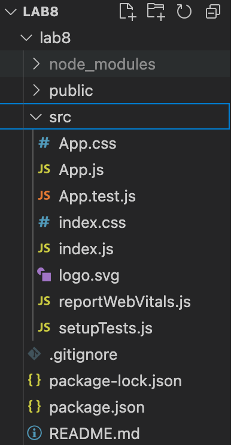
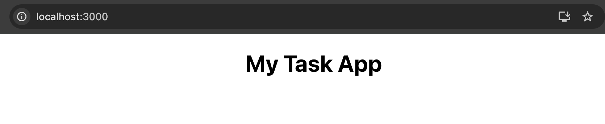
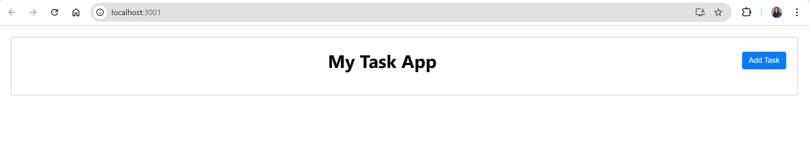
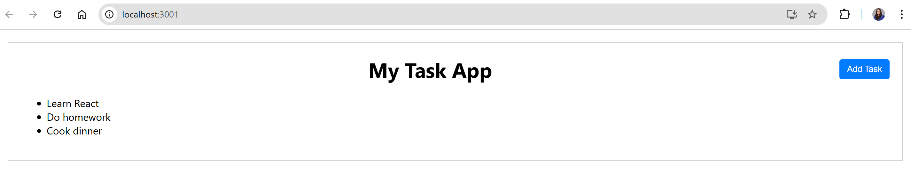
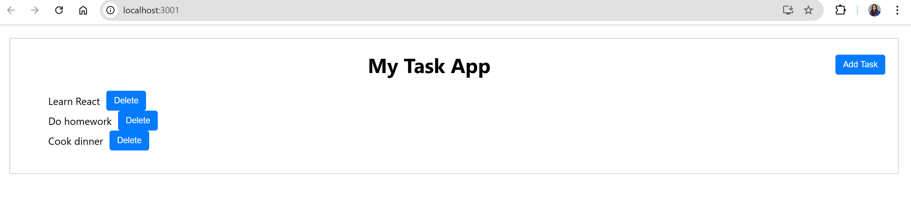

# 5610_labquiz8
React 1

## Lab 8 Activities

Activity 1 to Activity 5 are designed to be interconnected.

### Installation

Start by installing a React app with the following command:

```bash
npx create-react-app my-task-app
```

Replace "my-task-app" with the desired name of your application.


### Activity 1: Header Component

- **Goal**: Create a header component.
- Create a new folder named "components" inside the `src` folder.
- Inside the `components` folder, create a file named `Header.js`.
- In `Header.js`, create a functional component named `Header` that returns a `<header>` element containing an `<h1>` element which is "My Task App".
- In `App.js`, import `Header` and use it inside the `App` component.

Output:


### Activity 2: Styling

- **Goal**: Add some styling to your components.
- Add a `<button>` element in the `<header>` after the `<h1>` with the text "Add Task".
- Add the following CSS rules in `index.css`:
  - Create a border around the `<div>` in the `App` component, add padding 20px and margin 20 px.
  - Make the `<header>` inside the `Header` component a flexbox with its children evenly distributed and add bottom margin 20px. 
  - Use `align-items: center` to align the child elements vertically in the center.
- Use the `className` attribute to apply the styles to your elements.

Output:


### Activity 3: Task List

- **Goal**: Display a list of tasks.
- Add a hardcoded array of tasks in `App.js`:
  ```javascript
  const initialTasks = [
    { id: 1, text: "Learn React" },
    { id: 2, text: "Do homework" },
    { id: 3, text: "Cook dinner" },
  ];
  ```
- Below the `<Header>` component in `App.js`, add a `<ul>` element.
- Use the `array.map()` function to iterate through `initialTasks` and add an `<li>` element for each task's text.
- Check for any warnings in the browser's console and fix them (e.g., add `key` attribute).

Output:


### Activity 4: Componentizing the Task List 

- **Goal**: Refactor the task list into a separate component.
- Create a new file named `TasksList.js` inside the `components` folder.
- Move the code for rendering the list of tasks from `App.js` to `TasksList.js`.
- Create a functional component named `TasksList` that accepts the tasks array as a prop.
- Use `Fragments` to return multiple `<li>` elements from the `TasksList` component.
- Import `TasksList` into `App.js` and pass the `initialTasks` array as a prop.


### Activity 5: Adding State with useState

- **Goal**: Add state to manage the tasks.
- In `App.js`, use the `useState` hook to declare a state variable named `tasks` and initialize it with `initialTasks`.
  ```javascript
  const [tasks, setTasks] = useState(initialTasks);
  ```
- Update the `TasksList` component to receive a `deleteTask` function as a prop and add a delete button for each task.
- Your code should now support adding new tasks and deleting existing ones, making it more interactive.
- Add functionality to add a new task by clicking the "Add New Task" button. Use the `addTask` function in `App.js` to add a new task to the list.
- Add functionality to delete a task by clicking the "Delete" button next to each task in the list, using the `deleteTask` function.
- Delete the add button in Header.js

Output:


### Activity 6: Adding Icons to the Task Component

- **Goal**: Replace the "Delete" button with an icon for a more polished UI.

- Run the following command in your terminal to install **React Icons**:

```bash
npm install react-icons
```
- Explore the documentation to see the usage and available libraries and icons
- Update TasksList.js to replace the "Delete" button with a trash icon. Import the FaTrash icon from the Font Awesome library in React Icons.
- The FaTrash icon will now replace the delete button. Add some styling to space the icon from the task text and ensure it's clickable.
- When the icon is clicked, the associated task will be deleted using the deleteTask function passed as a prop.

### Activity 7: Event Handling and Conditional Rendering

- **Goal**: Fine-tune event handling for task deletion and implement conditional rendering when no tasks remain.

- Ensure that the `deleteTask` function is correctly passed down as a prop from `App.js` to the task component (e.g., `Task.js`).
- In `TasksList.js`, make sure you are passing the `deleteTask` function as a prop to each task:
 
   ```jsx
   <Task key={task.id} task={task} deleteTask={deleteTask} />
- In Task.js, add the onClick event to the trash icon:
```
<FaTrash onClick={() => deleteTask(task.id)} />
```
- The deleteTask function should now correctly update the task list when a task is deleted. Here's a reminder of the deleteTask function:

```javascript
const deleteTask = (id) => {
  setTasks(tasks.filter(task => task.id !== id));
};
```
- After deleting all tasks, display a message such as "No tasks left" instead of an empty list. Use conditional rendering in App.js to achieve this.

### Activity 8: Submit Form and Add a Task

- **Goal**: Add functionality to submit the form and add a new task.

- In `AddTask.js`, add an `onSubmit` handler to the `<form>` to prevent the default behavior and pass task details to `App.js`.

- In `App.js`, define an `addTask` function to add the new task to the `tasks` state.

- Pass the `addTask` function as a prop to `AddTask`.

```javascript
const addTask = (task) => {
  const id = Math.floor(Math.random() * 10000) + 1;
  const newTask = { id, ...task };
  setTasks([...tasks, newTask]);
};
```
- Add <AddTask onAddTask={addTask} /> in App.js to render the form.


### Activity 9: Controlled Components

- **Goal**: Use controlled components to manage the form inputs.

- In `AddTask.js`, add two state variables to keep track of the `<input>` elements.

- Set the `value` attributes of each `<input>` to the related state variable.

- Use the `onChange` attribute of each `<input>` to update the state when the user types in the input.

- Clear the form inputs after successfully adding a new task.

### Activity 10: Toggle Form Visibility

- **Goal**: Hide and show the form based on a button click.

- We want to hide the form component by default and only show it when the "Add Task" button is clicked.
- Declare a new state variable in `App.js` to track if the form should be shown or not.
- Add a function to toggle the state variable and pass it as a prop to the `Header` component.
- In `Header.js`, link the passed function to the button's `onClick` event.
- Update the text on the button based on the state (e.g., "Add Task" when the form is hidden, "Close" when the form is shown).
- Use a **conditional operator** instead of hard-coding the button's text.
- Pass the state value to conditionally render the form. If the state is `true`, show the form, and if `false`, hide it.

